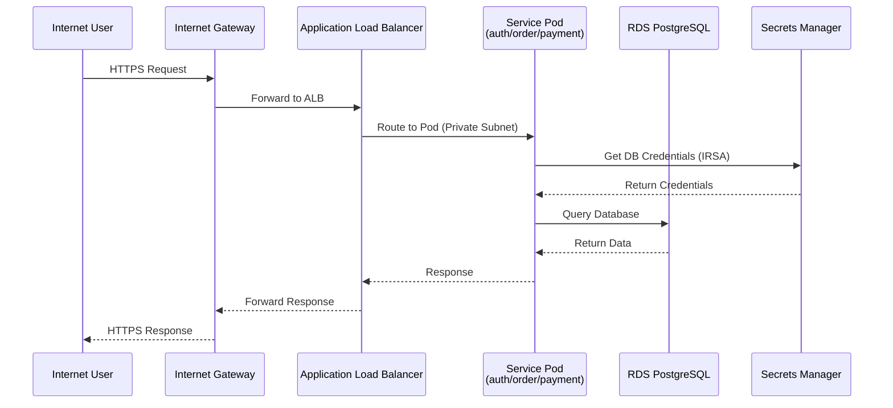
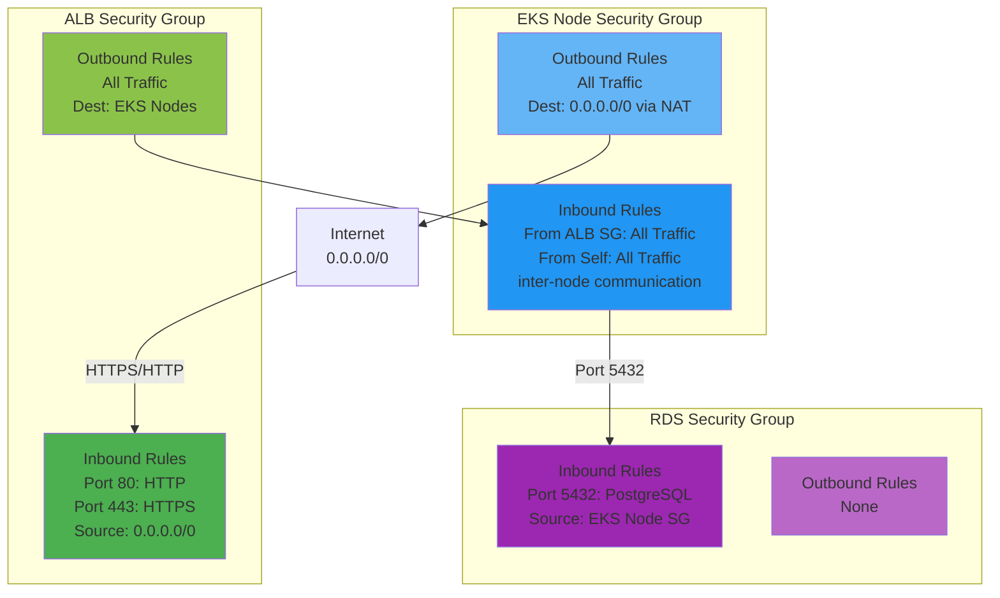
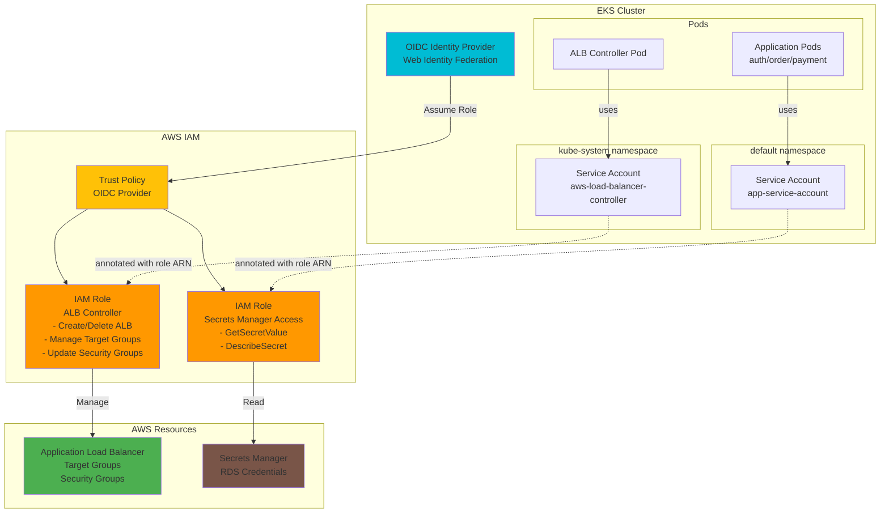
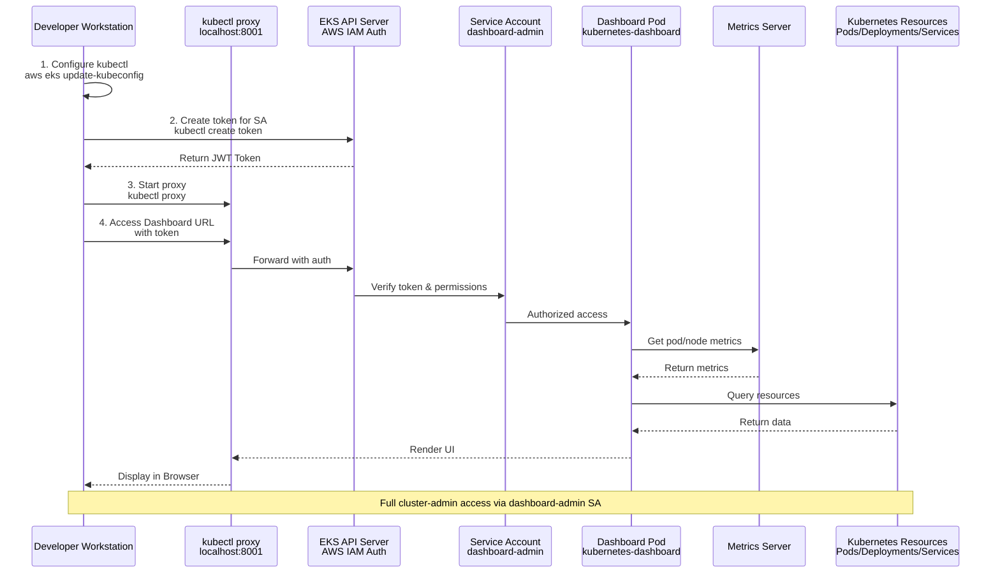

# AWS Infrastructure Architecture

## Network Architecture Diagram

```mermaid
graph TB
    subgraph "AWS Cloud - Region: us-east-1"
        subgraph "VPC 10.0.0.0/16"
            IGW[Internet Gateway]

            subgraph "Availability Zone 1 - us-east-1a"
                subgraph "Public Subnet 10.0.1.0/24"
                    NAT1[NAT Gateway 1<br/>Elastic IP]
                    ALB1[Application Load Balancer<br/>HTTPS:443 / HTTP:80]
                end

                subgraph "Private Subnet 10.0.10.0/24"
                    Node1[EKS Worker Node 1<br/>EC2 t3.medium]
                    RDS1[(RDS PostgreSQL<br/>db.t3.micro<br/>Port: 5432)]

                    subgraph "Pods in Node 1"
                        Auth[Auth Service<br/>:8087]
                        Payment[Payment Service<br/>:8085]
                        Dashboard[K8s Dashboard<br/>UI]
                    end
                end
            end

            subgraph "Availability Zone 2 - us-east-1b"
                subgraph "Public Subnet 10.0.2.0/24"
                    NAT2[NAT Gateway 2<br/>Elastic IP]
                    ALB2[Application Load Balancer<br/>HTTPS:443 / HTTP:80]
                end

                subgraph "Private Subnet 10.0.11.0/24"
                    Node2[EKS Worker Node 2<br/>EC2 t3.medium]
                    RDS2[(RDS Standby<br/>Multi-AZ)]

                    subgraph "Pods in Node 2"
                        Order[Order Service<br/>:8086]
                        React[React Frontend<br/>:80]
                        Metrics[Metrics Server]
                    end
                end
            end
        end

        subgraph "EKS Control Plane - Managed by AWS"
            API[API Server]
            Scheduler[Scheduler]
            Controller[Controller Manager]
            OIDC[OIDC Provider<br/>IRSA]
        end

        subgraph "AWS Services - Regional"
            ECR[ECR Repositories<br/>- auth-service<br/>- order-service<br/>- payment-service<br/>- react-frontend]
            Secrets[Secrets Manager<br/>- RDS Credentials<br/>- API Keys]
            CW[CloudWatch<br/>- Logs<br/>- Metrics]

            subgraph "IAM"
                ClusterRole[EKS Cluster Role]
                NodeRole[Node Group Role]
                ALBRole[ALB Controller Role<br/>IRSA]
                SecretRole[Secrets Manager Role<br/>IRSA]
            end
        end
    end

    Internet((Internet<br/>Users))

    %% Connections
    Internet -->|HTTPS/HTTP| IGW
    IGW --> ALB1
    IGW --> ALB2
    ALB1 --> Node1
    ALB2 --> Node2
    Node1 --> NAT1
    Node2 --> NAT2
    NAT1 --> IGW
    NAT2 --> IGW

    Auth -.->|Read| Secrets
    Order -.->|Read| Secrets
    Payment -.->|Read| Secrets

    Auth -->|Query| RDS1
    Order -->|Query| RDS1
    Payment -->|Query| RDS1

    RDS1 -.->|Replication| RDS2

    Node1 -->|Pull Images| ECR
    Node2 -->|Pull Images| ECR

    Node1 -.->|Logs/Metrics| CW
    Node2 -.->|Logs/Metrics| CW

    API --> Node1
    API --> Node2

    OIDC -.->|Assume| ALBRole
    OIDC -.->|Assume| SecretRole

    style Internet fill:#e1f5ff
    style IGW fill:#ff9800
    style ALB1 fill:#4caf50
    style ALB2 fill:#4caf50
    style NAT1 fill:#ff9800
    style NAT2 fill:#ff9800
    style Node1 fill:#2196f3
    style Node2 fill:#2196f3
    style RDS1 fill:#9c27b0
    style RDS2 fill:#9c27b0
    style ECR fill:#f44336
    style Secrets fill:#795548
    style CW fill:#607d8b
    style API fill:#00bcd4
    style OIDC fill:#00bcd4
```

## Traffic Flow Diagram

## CI/CD Flow Diagram

```mermaid
graph LR
    subgraph "Source Control"
        GH[GitHub Repository<br/>app/services/*]
    end

    subgraph "CI - Harness/GitHub Actions"
        Build[Build Docker Image<br/>Maven/npm]
        Test[Run Tests<br/>Unit + Integration]
        Scan[Security Scan<br/>Trivy/Snyk]
        Tag[Tag Image<br/>git-sha + latest]
    end

    subgraph "Container Registry"
        ECR1[ECR: auth-service]
        ECR2[ECR: order-service]
        ECR3[ECR: payment-service]
        ECR4[ECR: react-frontend]
    end

    subgraph "CD - Harness"
        Deploy[Deploy to EKS<br/>kubectl apply]
        Verify[Health Check<br/>Smoke Tests]
        Rollback[Rollback on Failure]
    end

    subgraph "EKS Cluster"
        Pods[Running Pods<br/>Deployment]
    end

    GH -->|Git Push| Build
    Build --> Test
    Test --> Scan
    Scan --> Tag
    Tag -->|Push| ECR1
    Tag -->|Push| ECR2
    Tag -->|Push| ECR3
    Tag -->|Push| ECR4

    ECR1 --> Deploy
    ECR2 --> Deploy
    ECR3 --> Deploy
    ECR4 --> Deploy

    Deploy --> Verify
    Verify -->|Success| Pods
    Verify -->|Failure| Rollback
    Rollback --> Pods

    style GH fill:#24292e
    style Build fill:#2088ff
    style ECR1 fill:#ff9900
    style ECR2 fill:#ff9900
    style ECR3 fill:#ff9900
    style ECR4 fill:#ff9900
    style Deploy fill:#00c853
    style Pods fill:#1976d2
```

## Component Details

### VPC Configuration
- **CIDR Block**: 10.0.0.0/16 (Dev), 10.1.0.0/16 (Prod)
- **Public Subnets**: 2 AZs (Dev) / 3 AZs (Prod)
  - Auto-assign public IPs
  - Tagged for ELB
- **Private Subnets**: 2 AZs (Dev) / 3 AZs (Prod)
  - No public IPs
  - Tagged for internal ELB
- **NAT Gateways**: One per AZ (HA)
- **Internet Gateway**: Single for VPC

### EKS Cluster
- **Control Plane**: Managed by AWS (Multi-AZ)
- **Node Group**:
  - Dev: 2-4 nodes (t3.medium)
  - Prod: 3-6 nodes (t3.large)
- **Networking**: VPC CNI plugin
- **OIDC Provider**: For IRSA

### RDS PostgreSQL
- **Instance**: db.t3.micro (Dev) / db.t3.small (Prod)
- **Storage**: 20GB (Dev) / 50GB (Prod) - Auto-scaling enabled
- **Backup**: 7 days retention
- **Multi-AZ**: Enabled for Prod
- **Encryption**: At rest & in transit
- **Access**: Private subnets only, via Security Groups

### ECR (Container Registry)
- **Repositories**: 4 (auth, order, payment, react-frontend)
- **Scanning**: Enabled on push
- **Lifecycle**: Keep last 10 images (Dev) / 20 (Prod)
- **Encryption**: AES256

### Security Groups

## IAM & IRSA (IAM Roles for Service Accounts)

## Kubernetes Dashboard Access Flow

## Cost Breakdown (Dev Environment - Monthly)

| Service | Resource | Cost |
|---------|----------|------|
| EKS | Control Plane | $73 |
| EC2 | 2x t3.medium nodes | $60 |
| RDS | db.t3.micro | $15 |
| NAT Gateway | 2x NAT Gateway | $65 |
| Data Transfer | ~100GB | $9 |
| ECR | Storage | $1 |
| CloudWatch | Logs | $5 |
| **Total** | | **~$228/month** |

## High Availability Features

✅ **Multi-AZ**: Worker nodes & RDS across 2 AZs (Dev) / 3 AZs (Prod)
✅ **NAT Gateways**: One per AZ for redundancy
✅ **Auto Scaling**: Node group auto-scales based on load
✅ **Health Checks**: ALB health checks for pods
✅ **RDS Multi-AZ**: Automatic failover for Prod
✅ **Load Balancing**: ALB distributes traffic across AZs

## Security Features

✅ **Private Subnets**: All app workloads in private subnets
✅ **Security Groups**: Least-privilege network access
✅ **IRSA**: No AWS credentials in pods
✅ **Secrets Manager**: Encrypted credential storage
✅ **Encryption**: RDS, ECR, EBS all encrypted
✅ **HTTPS**: ALB terminates SSL/TLS
✅ **Dashboard Auth**: Token-based authentication

## Monitoring & Logging

- **CloudWatch Logs**: EKS control plane logs
- **Container Insights**: Node & pod metrics
- **Metrics Server**: In-cluster resource metrics
- **Dashboard**: Web UI for cluster visualization
- **RDS Monitoring**: Performance Insights enabled
